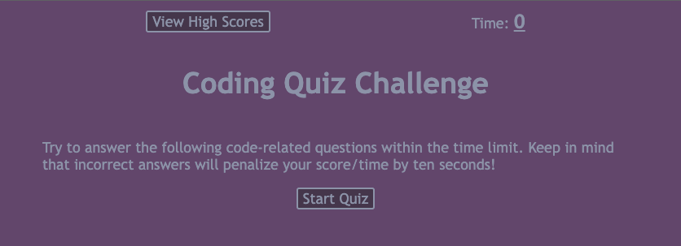
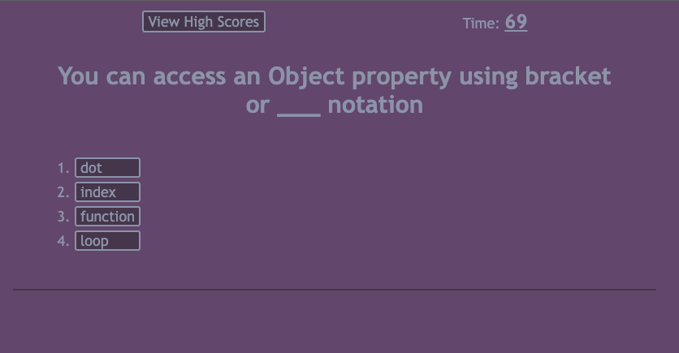
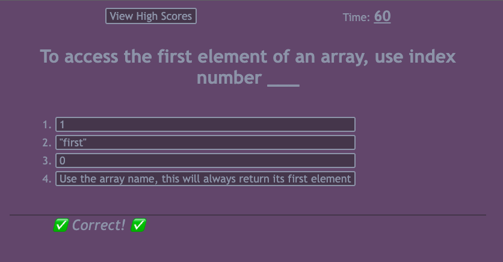
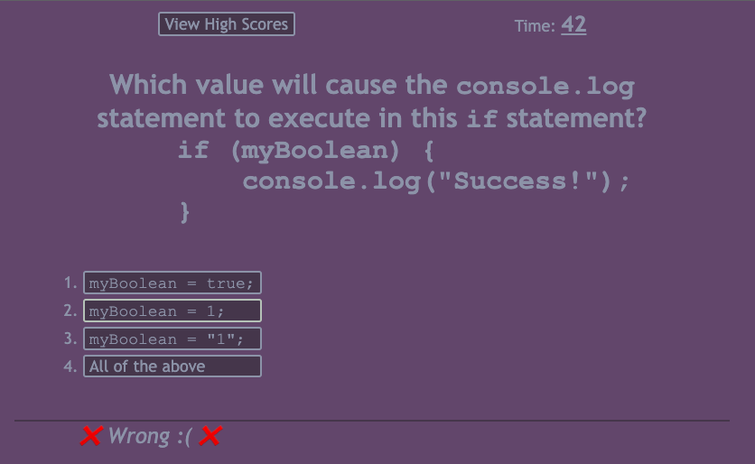
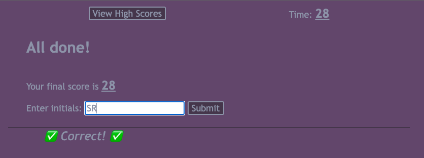
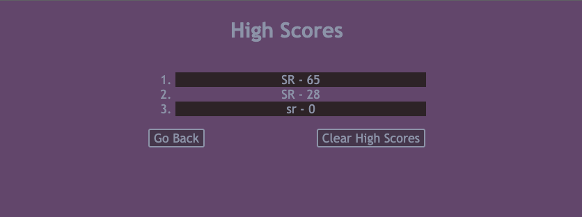
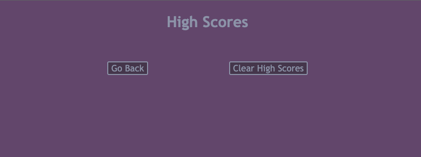

# Challenge 04 - Code Quiz

## Project Description

This Code Quiz will test the user's knowledge of JavaScript. It's a fun way for the end user to test their JavaScript knowledge when preparing for an interview. This is a timed quiz and the scores are saved for the user to beat their best score. Wrong answers will result in a 10 second penalty!

I had the opportunity to apply some more advanced concepts I have learned so far such as dynamically updating the DOM and using the browser's local storage to store/retrieve values. I also learned some additional methods available in JavaScript such as `Array.sort()` and how it is used to create a custom sort algorithm for the datatype stored in the array, as well as `Array.forEach()` to use as an alternative to `for` loops to iterate through a given array.

I still struggled with committing my code frequently on this project initially. However, I am getting used to enforcing a milestone system where I commit my code when I think I have reached a milestone whether it's a major or minor one. I also had the opportunity to apply some concepts that are not my strongest such as `flexbox` and CSS in general, but I feel like I'm slowly getting the hang of them!

## Table of Contents
- [User Story](#user-story)
- [Acceptance Criteria](#acceptance-criteria)
- [Links](#links)
- [Screenshots](#screenshots)

## User Story

```
AS A coding boot camp student
I WANT to take a timed quiz on JavaScript fundamentals that stores high scores
SO THAT I can gauge my progress compared to my peers
```

## Acceptance Criteria

```
GIVEN I am taking a code quiz
WHEN I click the start button
THEN a timer starts and I am presented with a question
WHEN I answer a question
THEN I am presented with another question
WHEN I answer a question incorrectly
THEN time is subtracted from the clock
WHEN all questions are answered or the timer reaches 0
THEN the game is over
WHEN the game is over
THEN I can save my initials and my score
```
 
## Links

To access the code repository and live website, use the links below:

- ### GitHub Repository URL
    https://github.com/sergiorodriguezdev/chl-04-code-quiz
- ### GitHub Pages URL
    https://sergiorodriguezdev.github.io/chl-04-code-quiz/

## Screenshots













